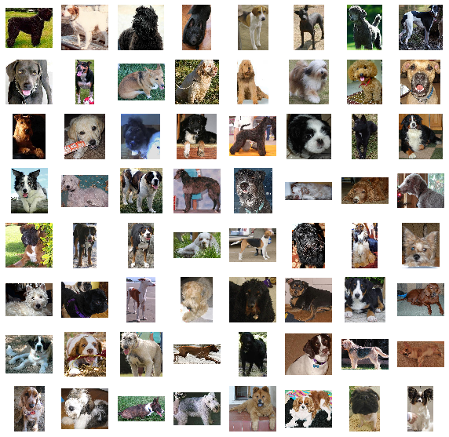
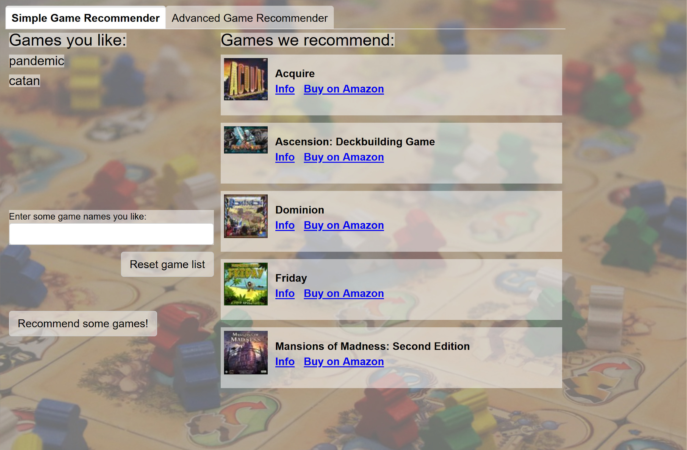
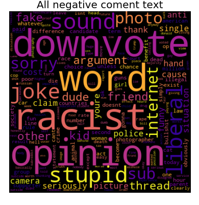
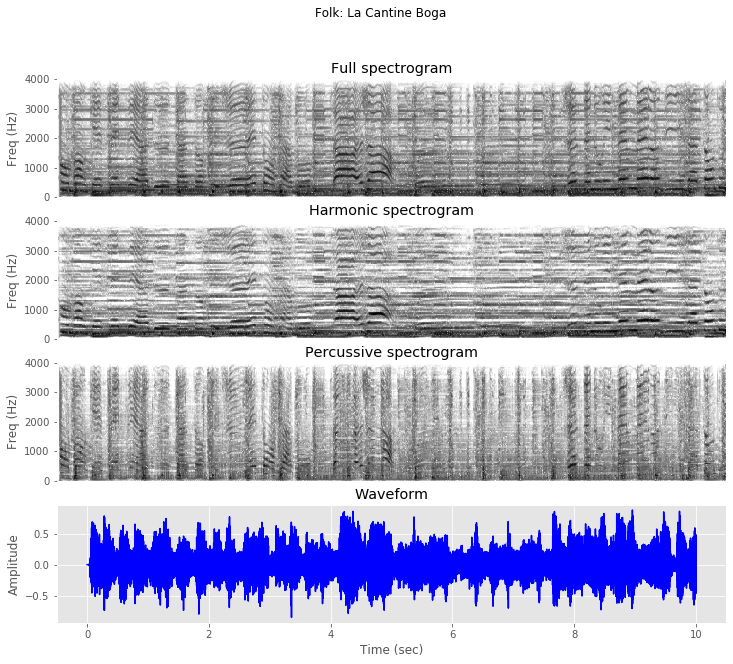
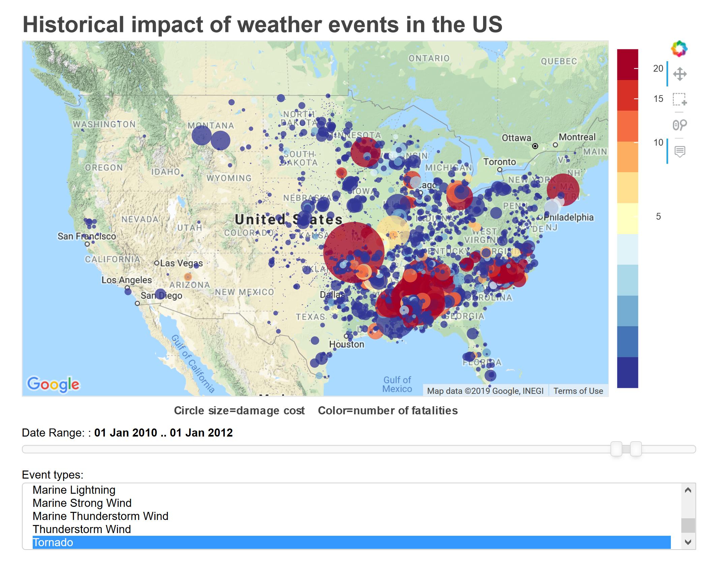
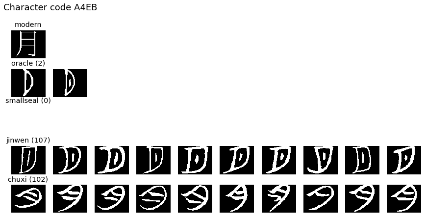
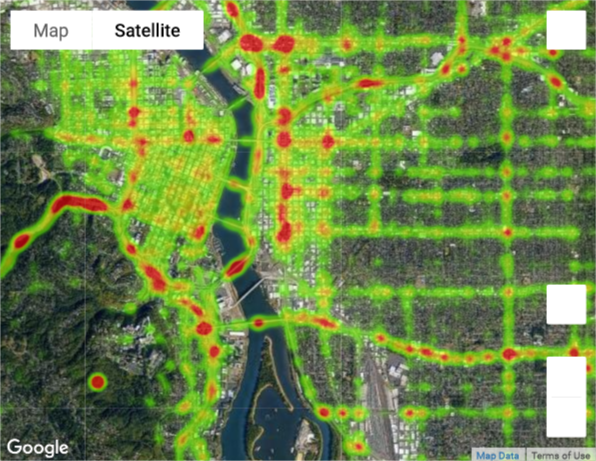
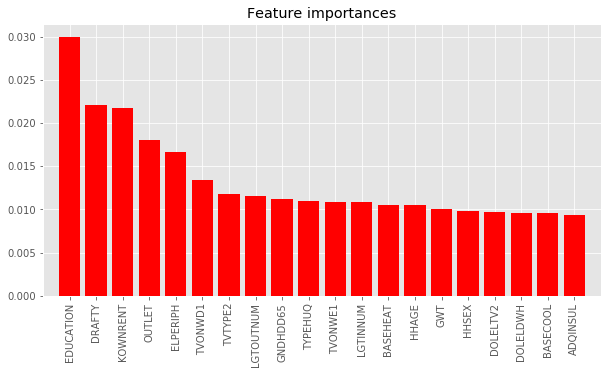

# Projects and Experiences

## [Training a SageMaker Deep Learning model and deploying it as a microservice](/SageMaker_dog_breed_id_API)

---

## [Boardgame recommender system](/boardgame_recommender)

---

## [Detecting trolls on Reddit](/reddit_troll_detector)

---

## Music genre ID

---

## NOAA severe weather interactive 4D map
<a href="https://github.com/johnmburt/projects/tree/master/NOAA_weather_events">

---

## Chinese character image classification

---

## Interactive traffic accident density map

---

## Factors that predict poverty

