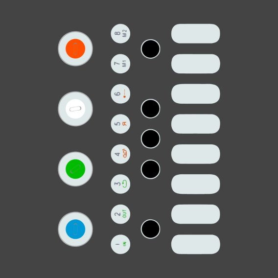

## About Me

Upon the realization that being tall does not equate to a natural ability to play basketball, I stuck with my passion of playing with computers. I started early by taking the family computer apart and piecing it back together and hoping it would still be functional. That was one of the first times I learned that you don't always get more than one chance when you mess up with wiring a computer. 

About a decade later, I help anyone who is interested in constructing a computer of their own, teach them how to build it, and how to learn about it through their own experiences. I love helping other people save money by being informed about potential options that could have been missed due to advertising or false rumors. 

I learned to merge this love for computers with the software that used it after being introduced to coding early in high school. This experience has enlightened me, while at the same time exposing me to the vast potential that grows more and more as time goes by. 

My favorite thing about computers is not what they currently do, but what they could potentially do. Any technical experience should have an expiration date, because the only thing that is guaranteed is change. As someone who loves change, and the new experiences that follow alongside, I welcome the future.  

---

## Projects and Experiences

[My Work Experience](/work_experience)
  

---

[Skribb.io Automated Drawing Bog](/skribblio_bot)
  

---

[YouTube Music Projects](/youtube_channel)
  

---

[Model Design and 3D Printing](/model_design)
  

---

[Discord Reverse Image Search Bot](/discord_search_bot)
  

---

[ThePageFlip](/thepageflip)
  

---

